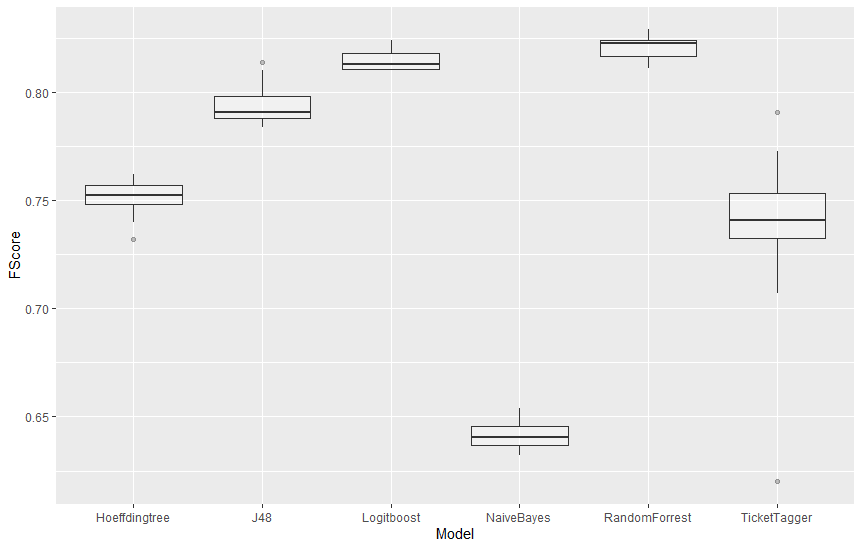

# Results

## Overview

`Comparison_models_weka.xlsx`:
- The results of comparing various models in WEKA with the balanced pandas data set.
    
`Comparing_preprocessing_weka.xlsx`:
- The results of comparing various models in WEKA with mutliple differently preprocessed data sets (balanced pa

`MBL_pandas_benchmark.csv`:
- {insert description}

`MBL_pandas_benchmark.txt`:
- {insert description}

`ML_pandas_benchmark.txt`:
- {insert description}

`original_vs_pandas.txt`:
- Here the ticket tagger results with data sets from two different repositories are compared

`Preprocessing_boxplot.png`:
- Boxplot that shows F-Scores depending on the results of `Comparing_preprocessing_weka.xlsx`

`Preprocessing_boxplot_wobayes.png`:
- Boxplot that shows F-Scores depending on the results of `Comparing_preprocessing_weka.xlsx` without the NaiveBayes model

`WEKA&MEKA_F-Scores.xlsx`:
- The results of comparing different models in WEKA/MEKA with different data sets (and different repositories)


## WEKA

WEKA (Waikato Environment for Knowledge Analysis) is a software developed by the University of Waikato in New Zealand.
It is a free software licensed under the GNU General Public License, and the companion to the book 'Data Mining: Practical Machine Learning Tools and Techniques'.
WEKA supports several data mining tasks, such as data preprocessing and classification. In the scope of this project,
WEKA is used for multilabel classification by using various models (J48, RandomForest, NaivaBayes and more). Finally the evaluation 
with Boost Models (AdaBoost, LogitBoost) is also taken into account when comparing the TicketTagger results with WEKA results.

For every evaluation, the WEKA default configuration for 10-fold Cross Validation was used.

### J48 

Classification Configuration: 
```
J48 -C 0.25 -M 2
```

### RandomForest

Classification Configuration: 
```
RandomeForest -P 100 -I 100 -num-slots 1 -K 0 -M 1.0 -V 0.001 -S 1
```

### NaiveBayes

Classification Configuration: none


### AdaBoost (with J48)

Classification Configuration: 
```
AdaBoostM1 -P 100 -S1 -I 10- weka.classifiers.trees.J48 --C 0.25 -M 2
```

### LogitBoost (with DecisionStump)

Classification Configuration: 
```
LogitBoost -P 100 -L-1.797…E308 -H 1.0 -Z3.0 -O1 -E1 -S1 -I 10 -W weka.classifiers.trees.DecisionStump
```


## MEKA (Binary Relevance)

The MEKA project provides an open source implementation of methods for multi-label learning and evaluation.
In multi-label classification, we want to predict multiple output variables for each input instance. 
This different from the 'standard' case (binary, or multi-class classification) which involves only a
single target variable. MEKA is based on the WEKA Machine Learning Toolkit; it includes dozens of multi-label
methods from the scientific literature, as well as a wrapper to the related MULAN framework. In this project,
we compare the multibinary results from fasttext and the binary relevance results from MEKA.

For every evaluation, the MEKA default configuration for 10-fold Cross Validation was used.

### J48 

Classification Configuration: 
```
BR – W weka.classifier.trees.J48 -- -C 0.25 -M 2
```

### RandomForest

Classification Configuration: 
```
BR – W weka.classifier.trees.RandomForest -- -I 100 -K 0 -S 1 -num-slots 1
```


### NaiveBayes

Classification Configuration: none


## Tables

Ticket Tagger Classification Performances:

[*Data Set Comparison (F-Score)*](./results/original_vs_pandas.txt) | Fasttext
--- | ---
Rafael_partial_english_rebalanced | 0.687
Rafael_only_english_rebalanced | 0.550
Pandas_balanced | 0.781		

Ticket Tagger Multi Binary Classication Performances:

[*Multi Binary F-Score*](./results/MBL_pandas_benchmark.txt) | Multi Binary (Fasttext)
--- | ---
Pandas_balanced | 0.745

WEKA Multilabel Classification Performance:

[*Data Set Comparison (F-Score)*](./results/WEKA&MEKA_F-Scores.xlsx) | J48 | RandomForest | NaiveBayer | AdaBoost | LogitBoost
--- | --- | --- | --- | --- | ---
Rafael_partial_english_rebalanced | 0.581 | 0.661 | 0.638 | 0.625 | 0.616
Rafael_only_english_rebalanced | 0.559 | 0.68 | 0.576 | 0.649 | 0.64
Pandas_balanced | 0.817 | 0.816 | 0.551 | 0.825 | 0.824

[*Model Comparison (F-Score)*](./results/Comparison_models_weka.xlsx) | Pandas_Balanced
--- | --- 
RandomTree | 0.661
J48 | 0.817
Hoeffding Tree | 0.714
NaiveBayes | 0.638
lazy Ibk | 0.684
rules.decision table | 0.77
Logit Boost with Decision Stump | 0.824
AdaBoost with J48 | 0.825


MEKA (Binary Relevance Algorithm) with different Data Sets (comparable to multi binary algorithm of Ticket Tagger):

[*F-Score micro averaged*](./results/WEKA&MEKA_F-Scores.xlsx) | J48 | RandomForest | NaiveBayer 
--- | --- | --- | ---
Rafael_partial_english_rebalanced | 0.577 | 0.576 | 0.616
Rafael_only_english_rebalanced | 0.593 | 0.590 | 0.635 
Pandas_balanced | 0.793 | 0.801 | 0.679

[*F-Score macro averaged by example*](./results/WEKA&MEKA_F-Scores.xlsx) | J48 | RandomForest | NaiveBayer 
--- | --- | --- | ---
Rafael_partial_english_rebalanced | 0.505 | 0.465 | 0.607
Rafael_only_english_rebalanced | 0.533 | 0.476 | 0.626 
Pandas_balanced | 0.757 | 0.755 | 0.691

[*F-Score macro averaged by label*](./results/WEKA&MEKA_F-Scores.xlsx) | J48 | RandomForest | NaiveBayer 
--- | --- | --- | ---
Rafael_partial_english_rebalanced | 0.577 | 0.572 | 0.616
Rafael_only_english_rebalanced | 0.593 | 0.587 | 0.635 
Pandas_balanced | 0.793 | 0.800 | 0.681

Preprocessing the pandas data set for Ticket Tagger and WEKA/MEKA:

*F-Score* (See: [[1]](./results/ticket-tagger-pandas.txt) [[2]](./results/Comparison_preprocessing_weka.xlsx)) | Fasttext | J48 | Logit Boost | Hoeffding Tree | NaiveBayes
--- | --- | --- | --- | --- | ---
data_set-pandas-balanded | 0.759 | 0.799 | 0.824 | 0.732 | 0.645
data_set-pandas-balanded-porter | 0.732 | 0.748 | 0.810 | 0.759 | 0.643
data_set-pandas-balanded-porter-stopword | 0.779 | 0.790 | 0.810 | 0.755 | 0.635
data_set-pandas-balanded-PTB | 0.660 | 0.798 | 0.817 | 0.75 | 0.654
data_set-pandas-balanded-PTB-stopword | 0.774 | 0.81 | 0.822  | 0.751 | 0.647
data_set-pandas-balanded-PTB-stopword-porter | 0.768 | 0.792 | 0.811 | 0.743 | 0.637
data_set-pandas-balanded-PTB-stopword-snowball | 0.767 | 0.785 | 0.813 | 0.74 | 0.637
data_set-pandas-balanded-snowball | 0.765 | 0.789 | 0.812  | 0.754 | 0.642
data_set-pandas-balanded-snowball-stopword | 0.744 | 0.792 | 0.813 | 0.751 | 0.632
data_set-pandas-balanded-stopword | 0.742 | 0.814 | 0.823 | 0.762 | 0.647
data_set-pandas-balanded-stopword-porter | 0.775 | 0.789 | 0.810  | 0.757 | 0.639
data_set-pandas-balanded-stopword-snowball | 0.787 | 0.784 | 0.813 | 0.758 | 0.638


## Comparison TicketTagger to WEKA and MEKA

We decided to compare the different models based on their F scores. In one table ([Link to the table](WEKA&MEKA_F-Scores.xlsx)) we compared
 the three models J48, RandomForest and Naïve Bayes for three different datasets.
  We took the original dataset used for Ticket Tagger, an only English version of this dataset and a completely different dataset. 
In the original study Ticket Tagger ([Link to the original Repository](https://github.com/rafaelkallis/ticket-tagger) ) has an average F-Score of 0.826. Out of all the models we tested 
 not one reached the 0.8 mark for this dataset.<br>
  
For the pandas dataset we tested we got better results. With WEKA the following models passed the 0.8 mark:
- J48
- RandomForest
- AdaBoost
- LogitBoost

With Binary Relevance in MEKA only RandomForest passed the 0.8 mark but J48 came close with up to 0.793. <br>
The best result with Rafaels original dataset we achieved with RandomForest in WEKA. 
The highest F-Score overall we got by using AdaBoost with  J48 on the Pandasdataset, this got us an F Score of 0.825. \
We tried if we would get better results by using preprocessed datasets: 
  
In this plot we can see the distribution of F-scores for each model if preprocessing 
techniques are used. We used 12 different combinations of Preprocessing
and ran them all for each model. In the above plot it can be observed 
that some of the models where more affected then others.
There we can see that with some Preprocessing the F-score
can be pushed up to the same level as Logitboost. Ticket Tagger does get both high and low results with preprocessing. Ticket Tagger got the highest F-Score with the stopword-snowball preprocessing. PTB preprocessing resulted in the lowest F-score for Ticket Tagger.
 The If we look at our result table 
([Link to the Table](Comparison_preprocessing_weka.xlsx)), the preprocessing method J48 performed the best with  is stopword. 
For Logitboost preprocessing actually lowered the F-Score.  With Hoeffdingtree all Preprocessing did improve the F-Score, but here again the stopword preprocessing did the best. For the Naïve Bayes it was actually the PTB Preprocessing that improved the F-Score the most and some of the other methods even lowered the F-Score. 
Overall AdaBoost and Logitboost did produce the best F-Scores but they are also by far the slowest models. 


# Discussion

- interpretations: what do the results mean?
- implications: why do the results matter?
- limitations: what can't the results tell us?
- recommendations: what practical actions or scientific studies should follow?

In our project, we are interested if we can increase the performance of Ticket Tagger. Our results show that the performance of Ticket Tagger is worse with our train and test dataset. So in our setting with data from the pandas project we have models that outperform the fasttext classifier used by Ticket Tagger. The following models would indeed improve the performance of Ticket Tagger:
- J48
- Random Forest
- Ada Boost
- Logit Boost

With these models, it is possible to enhance the process of issue labeling. This result matters in the context of large software projects, it could save a significant amount of money. The developers do not need to spend working hours on manual labeling.

The results show also the impact of the different preprocessing techniques on the performance. This is a relevant observation because the original implementation of Ticket Tagger does not perform preprocessing at all.

The results also show some limitations. We can not ensure that the performances of J48, Random Forest, Ada Boost, and Logit Boost are the best for the majority of repositories. We assessed in our study only issues of the pandas' repository which fulfills the following conditions:
- Over 1'000 issues per label (bug, enhancement, question)
- Issues are written in English
- The project does not use the Java Ecosystem

We have the hope that future work will replicate our findings of the study. Furthermore, a more diverse validation set of issues of different projects would lead to higher confidence in the results.


